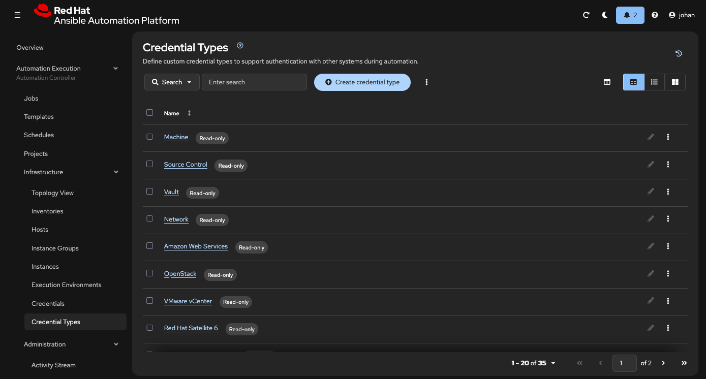
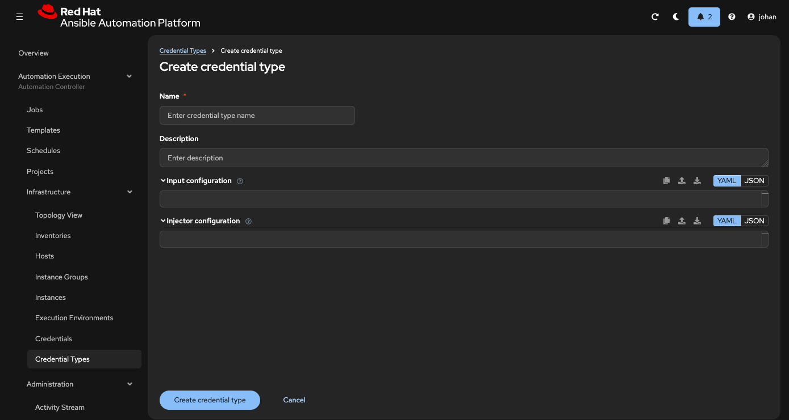
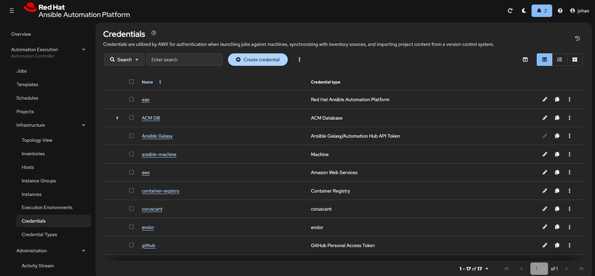

# AAP Kickstart

Kubernetes manifests and configuration for deploying Red Hat Ansible Automation Platform (AAP) on OpenShift.

## Prerequisites

Before deploying AAP, ensure you have:

- OpenShift cluster (4.14+) with cluster-admin access
- `oc` CLI tool installed and configured
- Valid Red Hat subscription with AAP entitlements
- Storage class available for persistent volumes (e.g., OCS/ODF)

## Installation

### 1. Deploy the AAP Operator

The AAP operator manages the lifecycle of Ansible Automation Platform components on your cluster.

0. Fork this repository first:
1. Clone your forked repo to the laptop. 

```bash
$ git clone <repository-url>
$ cd aap-kickstart
```
3. login to the cluster using oc/kubectl

```bash
$ oc login -u userXX <api-address>
```

4. Apply the operator installation manifest:

```bash
$ oc apply -f operators/aap-operator-install.yaml
```

This manifest creates:
- `aap` namespace with cluster monitoring enabled
- OperatorGroup for the AAP operator
- Subscription to AAP operator 2.6 (stable channel)

2. Verify the operator installation:

```bash
$ oc get csv -n aap
```

Wait until the CSV (ClusterServiceVersion) shows `Succeeded` in the PHASE column:

```
NAME                                              DISPLAY                                         VERSION   REPLACES   PHASE
ansible-automation-platform-operator.v2.6.0-1     Ansible Automation Platform                    2.6.0-1              Succeeded
```

3. Check operator pod is running:

```bash
$ oc get pods -n aap
```

Expected output:

```
NAME                                                              READY   STATUS    RESTARTS   AGE
ansible-automation-platform-operator-controller-manager-xxxxx    2/2     Running   0          2m
```

### 2. Deploy AutomationController Instance

Once the operator is running, you can deploy an AutomationController instance (the main AAP controller).

> **Note:** Before deploying, review and customize the AutomationController manifest in `operators/aap-2.6-instance.yaml` for your environment.

Key configuration options:
- Storage class for database and projects
- Resource requests/limits
- Admin credentials
- Route/ingress settings

Deploy the controller:

```bash
oc apply -f operators/aap-2.6-instance.yaml
```

Monitor the deployment:

```bash
oc get automationcontroller -n aap -w
```

Wait for the controller to reach `Running` status (this may take 5-10 minutes).

### 3. Access the AAP Web UI

Once deployed, get the route URL:

```bash
oc get route -n aap
```

Get the admin password:

```bash
oc get secret aap-admin-password -n aap -o jsonpath='{.data.password}' | base64 -d
```

Login to the AAP web interface:
- URL: https://aap-aap.apps.<cluster-domain>
- Username: `admin`
- Password: (from the secret above)

### 4. Create unique credential types for different OpenShift clusters

To address multiple OpenShift clusters from the same inventory we need to create unique credential types in AAP one for each cluster. 

On the left hand side menue under Automation Execution > Infrastructure > Credential types




Klick create Create credential type



Enter a name for the credential and a description. 

add input configuration:
```bash
fields:
  - id: host
    label: OpenShift or Kubernetes API Endpoint
    type: string
    help_text: The OpenShift or Kubernetes API Endpoint to authenticate with.
  - id: bearer_token
    label: API authentication bearer token
    type: string
    secret: true
  - id: verify_ssl
    label: Verify SSL
    type: boolean
    default: true
  - id: ssl_ca_cert
    label: Certificate Authority data
    type: string
    secret: true
    multiline: true
required:
  - host
  - bearer_token
```

add injector configuration: 
```bash
  env:
    ENDOR_API_URL: '{{ host }}'
    ENDOR_K8S_TOKEN: '{{ bearer_token }}'
    ENDOR_VERIFY_SSL: '{{ verify_ssl }}'
    ENDOR_CA_CERT: '{{ ssl_ca_cert }}'
```

If you have more OpenShift Clusters create a new credential type for each cluster so they are reday. 

### 5. Create ServiceAccount and token to use by ansible.

This token should be scoped but for now let's just add a cluster-admin scoped token.

Make sure you are in the aap project: `oc project aap`

Add a ServiceAccount: `oc create sa controller-credential -n aap`

Add cluster-admin rights to the service account: `oc adm policy add-cluster-role-to-user cluster-admin -z controller-credential`

Create a token for the SA: `oc create token controller-credential --duration=4294967296s`
(hmm 136 years, 29 weeks, 3 days, 6 hours, 28 minutes, 16 seconds. :-0). 

Copy it and add it as a Credential in the controller using the new credential types you created in previous step (repeat for all clusters):



## Directory Structure

```
aap-kickstart/
├── README.md                          # This file
├── operators/                        # Operator manifests   
    ├── aap-operator-install.yaml     # Combined operator installation manifest
    └── aap-2.6-instance.yaml         # Automation controller instance 

```

### Recommended Next Steps

After deployment:

1. Configure AAP with the `infra.aap_configuration` collection
2. Set up inventories, credentials, and job templates
3. Integrate with external authentication (LDAP/SAML)
4. Configure RBAC and teams
5. Set up backup/restore procedures

## Troubleshooting

### Operator not installing

Check subscription status:

```bash
oc describe subscription ansible-automation-platform-operator -n aap
```

Check install plan:

```bash
oc get installplan -n aap
```

### Controller pods failing

Check pod logs:

```bash
oc logs -n aap <pod-name>
```

Check events:

```bash
oc get events -n aap --sort-by='.lastTimestamp'
```

### Database connection issues

Verify PostgreSQL pod is running:

```bash
oc get pods -n aap -l app.kubernetes.io/component=database
```

## References

- [AAP Operator Documentation](https://access.redhat.com/documentation/en-us/red_hat_ansible_automation_platform/)
- [AAP Configuration Collection](https://galaxy.ansible.com/ui/repo/published/infra/aap_configuration/)
- [OpenShift Operators](https://docs.openshift.com/container-platform/latest/operators/understanding/olm-what-operators-are.html)

## License

Apache 2.0
